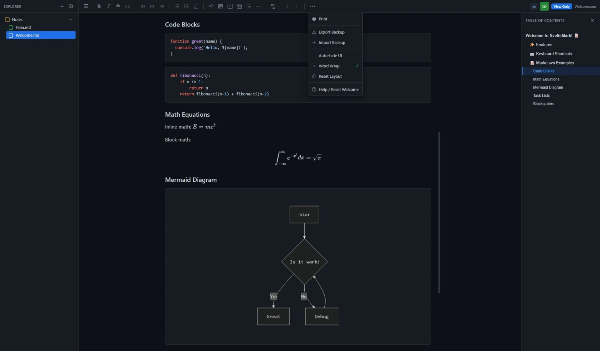

<div align="center">


# SvelteMark

A **privacy-first**, **open-source**, **local-only** markdown editor built with Svelte 5.

Your notes never leave your device. No accounts. No tracking. No cloud.

[](https://sm.fana.my.id)
[](LICENSE)
[](https://svelte.dev/)

</div>

---


<!-- TODO: Add actual screenshot -->

## Features

### Privacy & Security

- **100% Local Storage** - All data stored in your browser's IndexedDB
- **No Server Communication** - Zero network requests for your notes
- **No Account Required** - Start writing immediately, no sign-up
- **Export Your Data** - Full data portability with JSON backup

### Core Editor

- **CodeMirror 6 Editor** - Powerful text editing with syntax highlighting
- **Live Preview** - Real-time markdown rendering with GitHub styling
- **Scroll Sync** - Proportional scroll synchronization between editor and preview
- **Auto-save** - Automatic saving with debounced updates

### Markdown Support

- **GitHub Flavored Markdown** - Tables, task lists, strikethrough, and more
- **Math Equations** - LaTeX math rendering with KaTeX
- **Mermaid Diagrams** - Flowcharts, sequence diagrams, pie charts
- **Syntax Highlighting** - Code block highlighting for 100+ languages

### File Management

- **File Explorer** - Organize notes in folders with tree view
- **Drag & Drop** - Reorder files and folders by dragging
- **Root-Level Files** - Create files outside folders at root level
- **Rename & Delete** - Right-click context menu for file operations
- **Nested Folders** - Support for hierarchical folder structure

### UI/UX

- **GitHub Dark Theme** - Beautiful dark theme matching GitHub's design
- **Resizable Panels** - Drag to resize sidebar and editor/preview split
- **Auto-hide UI** - Distraction-free writing mode
- **View-only Mode** - Focus on reading without the editor

### Tools

- **Print Support** - Print documents with light theme (Ctrl+P)
- **Export/Import** - Backup and restore all your notes as JSON
- **Help** - Built-in welcome guide with markdown examples

## Screenshots

### Main Editor View


### Preview Mode


### Preview Mode w/ TOC



## Getting Started

### Prerequisites

- [Node.js](https://nodejs.org/) (v18 or higher)
- [pnpm](https://pnpm.io/) (recommended) or npm

### Installation

```bash
# Clone the repository
git clone https://github.com/MasFana/sveltemark.git
cd sveltemark

# Install dependencies
pnpm install

# Start development server
pnpm dev
```

Open [http://localhost:5173](http://localhost:5173) in your browser.

### Building for Production

```bash
# Build the application
pnpm build

# Preview the production build
pnpm preview
```

## Keyboard Shortcuts

| Shortcut | Action   |
| -------- | -------- |
| `Ctrl+S` | Save now |
| `Ctrl+B` | Bold     |
| `Ctrl+I` | Italic   |
| `Ctrl+P` | Print    |

## Tech Stack

- **Framework**: [Svelte 5](https://svelte.dev/) with Runes
- **Build Tool**: [Vite](https://vitejs.dev/)
- **Editor**: [CodeMirror 6](https://codemirror.net/)
- **Database**: [Dexie.js](https://dexie.org/) (IndexedDB wrapper)
- **Markdown Processing**:
  - [unified](https://unifiedjs.com/) ecosystem
  - [remark-gfm](https://github.com/remarkjs/remark-gfm) - GitHub Flavored Markdown
  - [remark-math](https://github.com/remarkjs/remark-math) + [rehype-katex](https://github.com/remarkjs/remark-math/tree/main/packages/rehype-katex) - Math equations
  - [rehype-highlight](https://github.com/rehypejs/rehype-highlight) - Code syntax highlighting
- **Diagrams**: [Mermaid](https://mermaid.js.org/)
- **Styling**: [github-markdown-css](https://github.com/sindresorhus/github-markdown-css)
- **Deployment**: [Cloudflare Pages](https://pages.cloudflare.com/) (optional)

## Project Structure

```
fanadown/
├── src/
│   ├── lib/
│   │   ├── components/
│   │   │   ├── Editor.svelte      # CodeMirror editor component
│   │   │   ├── Preview.svelte     # Markdown preview component
│   │   │   ├── Sidebar.svelte     # File explorer sidebar
│   │   │   ├── FileTree.svelte    # Recursive file tree
│   │   │   └── Toolbar.svelte     # Formatting toolbar
│   │   ├── appState.svelte.ts     # Global reactive state
│   │   ├── db.ts                  # Dexie database operations
│   │   ├── markdown.ts            # Markdown processing pipeline
│   │   └── index.ts               # Library exports
│   └── routes/
│       ├── +layout.svelte         # App layout
│       └── +page.svelte           # Main page
├── static/                        # Static assets
├── package.json
├── svelte.config.js
├── vite.config.ts
└── tsconfig.json
```

## Data Storage

SvelteMark uses **IndexedDB** via Dexie.js for local-first data storage. All your notes are stored in your browser and never leave your device.

### Database Schema

- **folders**: `id, name, parentId, isOpen`
- **files**: `id, folderId (nullable), title, content, createdAt, updatedAt`

> Note: `folderId` can be `null` for root-level files (files not inside any folder).

### Export/Import

You can export all your data as a JSON file for backup:

1. Click the **⋯** (More) menu in the toolbar
2. Select **Export Backup**
3. Save the JSON file

To restore:

1. Click **Import Backup**
2. Select your backup JSON file

## Theming

The application uses a GitHub-inspired dark theme with the following color palette:

| Element    | Color     |
| ---------- | --------- |
| Background | `#0d1117` |
| Surface    | `#161b22` |
| Border     | `#30363d` |
| Text       | `#c9d1d9` |
| Muted      | `#8b949e` |
| Accent     | `#58a6ff` |
| Success    | `#3fb950` |
| Warning    | `#d29922` |
| Danger     | `#da3633` |

## Contributing

Contributions are welcome! Please feel free to submit a Pull Request.

1. Fork the repository
2. Create your feature branch (`git checkout -b feature/AmazingFeature`)
3. Commit your changes (`git commit -m 'Add some AmazingFeature'`)
4. Push to the branch (`git push origin feature/AmazingFeature`)
5. Open a Pull Request

## License

This project is licensed under the MIT License - see the [LICENSE](LICENSE) file for details.

## Acknowledgments

- [Svelte](https://svelte.dev/) - The amazing reactive framework
- [CodeMirror](https://codemirror.net/) - The versatile code editor
- [GitHub](https://github.com/) - Design inspiration for the dark theme
- [ByteMD](https://bytemd.js.org/) / [StackEdit](https://stackedit.io/) - Scroll sync inspiration

---

Made with Svelte 5 | Open Source | Privacy First
